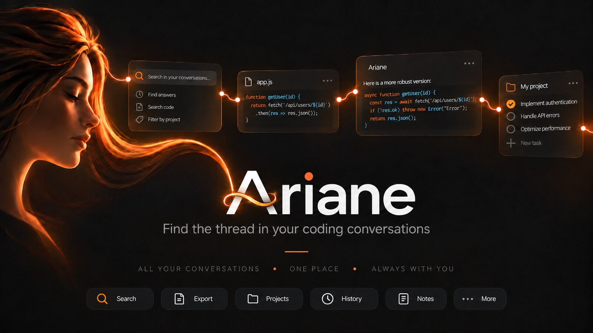
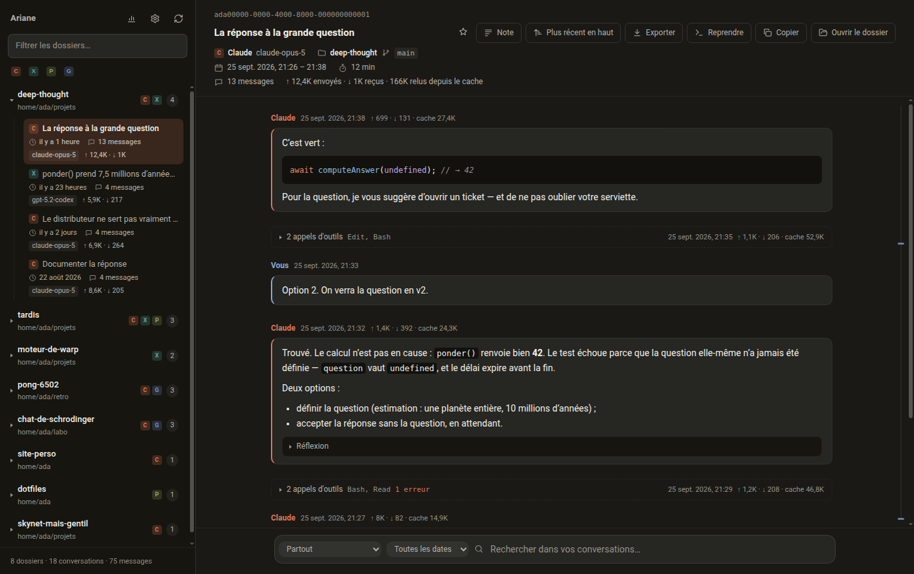

<h1 align="center">Ariane</h1>

<p align="center">
  <strong>Find the thread in your coding conversations — whichever assistant you used.</strong>
</p>

<p align="center">
  
  
  
  
</p>

<p align="center">
  <a href="README.md">English</a> · <a href="README.fr.md">Français</a>
</p>

---

Claude Code, Codex, Copilot CLI, Qwen, Gemini, the Antigravity CLI and the VS Code chat panel each
archive your conversations on your own disk. In seven different formats, under seven different
directories, with no way to browse them — and above all, never seeing one another.

**Ariane brings them together, and sorts them by working directory.** It reads those folders
read-only, never writes to them, and never sends anything anywhere.



## Why folders, not assistants

The conversations about one project end up spread across whichever assistant was at hand that day,
and no assistant shows you that — each one sees only its own data. Ariane groups by the directory a
conversation ran in, so a project reads as one history rather than five.

On the machine it was built on, **20 folders had been worked on by more than one assistant**. The
three busiest:

| Assistants on one and the same folder | Conversations |
|---|---:|
| Codex · Claude · Gemini · Copilot · VS Code | **72** |
| Claude · Codex · Copilot · Gemini · VS Code | **46** |
| Claude · Codex · Copilot · VS Code | 39 |

## What it does

- **Every working folder**, with its real path — accents included, never the mangled encoded name
  some assistants write on disk.
- **A chip per assistant** on each folder, and separate lists in the panel: Codex and Claude
  conversations never blend into one another.
- **Instant full-text search**, accent-insensitive: `mathematiques` finds `Mathématiques`.
  Everywhere, or narrowed to one assistant, one folder, one conversation — and to a period: 7 days,
  30 days, this year. Open a result and **the words you searched for are highlighted** wherever they
  appear in the conversation, not just in the snippet.
- **A compacted conversation stays one conversation**: when Claude Code splits it across two files,
  Ariane says so — *“Part 2 of 3”* — and takes you from one part to the next.
- **Your own marks**: a star on a conversation **or on a single message**, a note under the title,
  and a view that shows only what you marked. They live in a file of yours, outside the index: an
  update of Ariane cannot erase them.
- **Resume a conversation** in its own terminal, with the right assistant, in the right folder.
- **Export** to Markdown or PDF, crediting each speaker exactly as the screen does.
- **Nine languages**, chosen or following the system, and a light, dark or system theme.
- **Nothing is lost**: when an assistant deletes a transcript, Ariane keeps the only copy left.

## Supported assistants

| Assistant | Where it stores conversations | Resume |
|---|---|---|
| **Claude Code** | `~/.claude/projects/` | by id |
| **Codex** | `~/.codex/sessions/` | by id |
| **Copilot CLI** | `~/.copilot/session-state/` | by id |
| **Qwen Code** | `~/.qwen/projects/*/chats/` | by id |
| **Gemini CLI** | `~/.gemini/tmp/*/chats/` | latest only |
| **Antigravity CLI** (`agy`) | `~/.gemini/antigravity-cli/brain/` | by id |
| **VS Code chat** | `<config>/User/workspaceStorage/` | not supported |

VS Code chat also covers **VSCodium and Cursor**, which share its storage.

## Install

```bash
git clone https://github.com/ZamBoyle/ariane
cd ariane
npm install
npm start
```

That is all. Verified from a clean clone: `npm install`, then `npm run test:all` passes every suite
with no other preparation.

**Requirements: Node 22.14 or newer, and nothing else.** In particular, **no C++ compiler** —
unusual for a project with a native module, but `better-sqlite3` ships one Node-API binary per
system and npm merely unpacks it. Nothing is compiled, and nothing has to be rebuilt when Electron
moves. The floor is Node-API 10, which lands in Node 22.14: an older Node installs without
complaining, then dies on the first query.

So npm is told to refuse rather than warn. `.npmrc` sets `engine-strict=true`, and an older Node
stops the install with both versions named:

```
npm error notsup Required: {"node":">=22.14"}
npm error notsup Actual:   {"node":"v20.19.0","npm":"10.8.2"}
```

That is the whole requirement. There is nothing else to install, and no version manager to learn.

No Python either, and no `make`. npm runs an implicit `node-gyp rebuild` for any package holding a
`binding.gyp`, and `better-sqlite3` holds one although its binary is already inside the package.
On Linux that wanted python3 and make to build nothing; on Windows it fails outright — gyp finds a
Python it cannot run and takes the whole install down with it. `.npmrc` therefore sets
`ignore-scripts=true`. Nothing in the tree needs a script: the only other one belongs to
electron-winstaller, for a Squirrel target these packages do not use, and Electron declares none at
all — it fetches its binary on first use.

On a minimal Linux — WSL, a container, a CI image — Electron also needs system libraries that
`npm install` does not bring: a desktop Ubuntu already has them, a bare one does not. They are the
ones listed in `build.deb.depends`, which the `.deb` installs by itself and a source checkout does
not. On a bare Ubuntu 24.04, four were missing:

```bash
sudo apt install -y libnss3 libnotify4 libsecret-1-0 xdg-utils
```

Without them the binary does not start at all: `error while loading shared libraries: libnspr4.so`.

On Linux, if the launch aborts on `chrome-sandbox`, once and for all:

```bash
sudo chown root:root node_modules/electron/dist/chrome-sandbox
sudo chmod 4755 node_modules/electron/dist/chrome-sandbox
```

## Build the packages

```bash
npm run dist:deb      # .deb            <- the useful one on Ubuntu
npm run dist:linux    # AppImage + .deb
npm run dist:setup    # the Windows installer
npm run dist:exe      # the portable .exe
npm run dist:mac      # .dmg
```

| Target | On Windows | On Linux | On macOS |
|---|---|---|---|
| `.deb`, AppImage | — | yes | — |
| `.exe`, NSIS installer | yes | **needs `wine`** | **needs `wine`** |
| `.dmg` | — | — | yes |

The packages are **not signed**: a downloaded `.exe` raises SmartScreen’s *unknown publisher*, and a
downloaded `.dmg` is quarantined by macOS, which claims the file is damaged when it is not
(`xattr -dr com.apple.quarantine`). **An app you compiled yourself has neither problem** — macOS
quarantines only what was downloaded.

## Your data stays on your machine

- Ariane reads the assistants’ folders **read-only** and never writes to them.
- **No network, at all.** The renderer’s content security policy is `connect-src 'none'`; there is
  no telemetry, no update check, no account.
- Everything Ariane owns — the index, the archive, your settings and your marks — lives in the app’s
  user-data directory (`~/.config/Ariane` on Linux).

## Under the hood

- **Selective by design.** Measured on 1.25 GB written by seven assistants, only 6.2 MB is
  conversation: tool output and base64 payloads are stored as a truncated preview or discarded, and
  never indexed. That is why a full pass takes about ten seconds.
- **Incremental.** An unchanged transcript costs one `stat`; a grown one is resumed from its stored
  byte offset. A full pass with nothing new: ~60 ms.
- **Never puts words in your mouth.** The API records tool results under the role `user`: measured
  on a real corpus, only 12 % of `user` records were actually typed by a person. Ariane credits
  nobody for the rest.

[`ARCHITECTURE.md`](ARCHITECTURE.md) has the long version: the data path end to end, the adapter
contract, the schema and the security model. [`CHANGELOG.md`](CHANGELOG.md) records what was built
and what it cost to measure; [`ROADMAP.md`](ROADMAP.md) what is left.

## Development

```bash
npm test              # 673 unit tests, no framework (node --test)
npm run test:render   # 155 renderer checks, under Electron
npm run test:ui       # 26 layout checks
npm run test:splash   # 7 checks on the splash screen
npm run test:all      # all four
npm run audit:noise   # looks for prose an extractor throws away, on your own data
npm run demo          # the real app on a fictional corpus
npm run lint
```

The core (`src/core/`) is **plain Node, with no Electron import at all**: reading, extraction and
search are tested without opening a window — including the IPC layer, where `electron` is replaced
by a stub. The two Electron suites exist because the bugs they guard against live in the DOM.

**Adding an assistant is writing one module** against the contract in
`src/core/agents/contract.js` — three questions: where are the sessions, which folder did each run
in, and what is a message. Nothing else in the app changes.

## License

**GNU GPL v3 or later**, with an attribution clause — see [`LICENSE`](LICENSE) and
[`NOTICE`](NOTICE).

You may use, study, modify and redistribute Ariane, commercially included. In exchange: **publish
your source** under the same license if you redistribute it or anything derived from it, and
**preserve the attribution** — `Ariane — © 2026 Johnny Piette — https://github.com/ZamBoyle/ariane`
— in the source and in the legal notices your work displays, if it displays any. That last point is
an additional term under **section 7(b)** of the GPLv3, which allows it explicitly, and it cannot be
removed by those who redistribute.

## Author

**Johnny Piette** — [@ZamBoyle](https://github.com/ZamBoyle)

Copyright © 2026 Johnny Piette. Ariane is free software, and comes with no warranty whatsoever.
